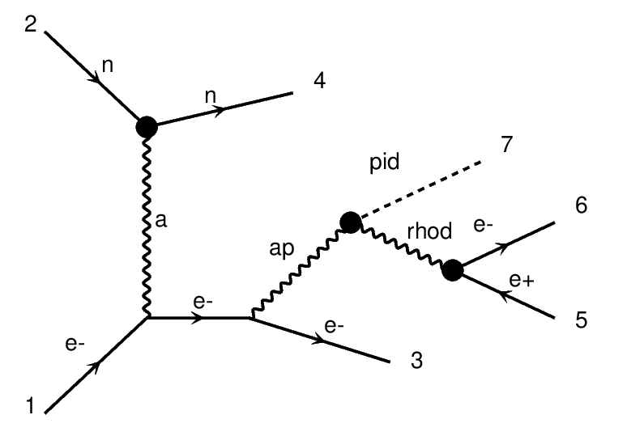

# SIMPs
Strongly Interacting Massing Particles

This MadGraph5 model is meant to introduce a hidden sector (HS) which has a hidden strong interaction creating various "hadrons" within the HS. This HS can then be missed with the SM via a portal interaction with a dark photon (A') mixing with the standard photon.

This model was originally copied from hps-mc and only has the neutral vector meson (called `rhod`). This workspace is gearted towards making a slight extension to this model allowing a charged vector meson decays.

